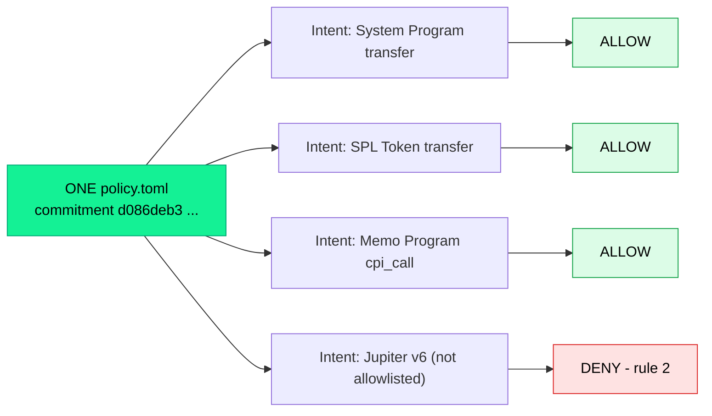
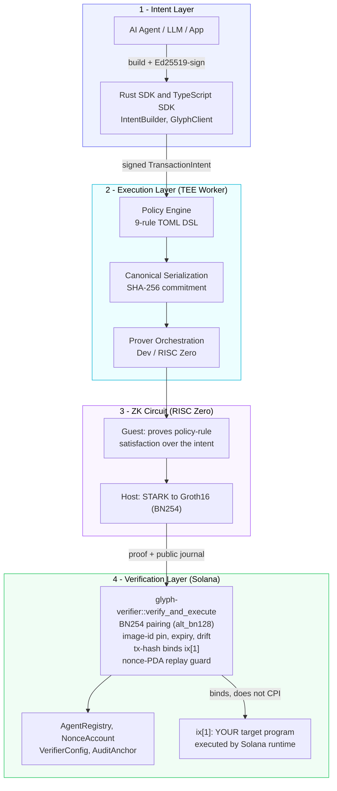
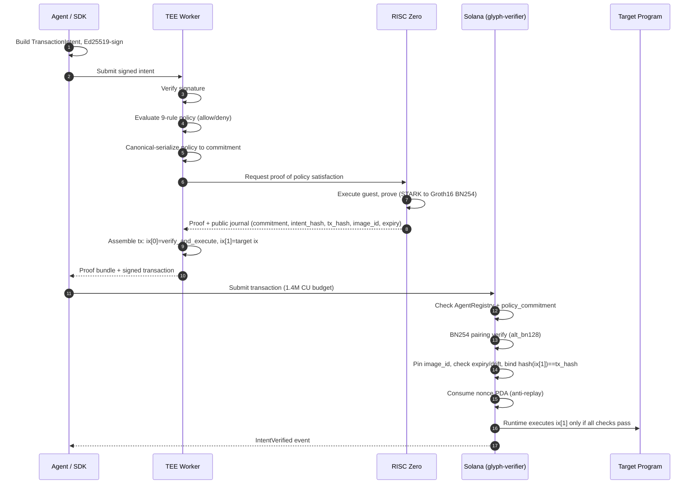
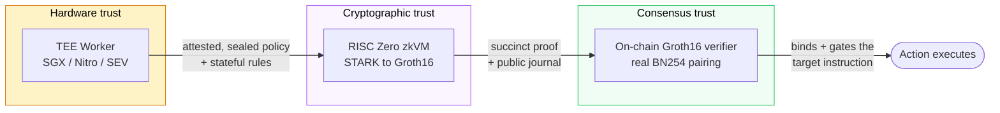
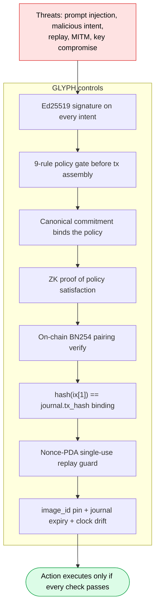

<div align="center">

# GLYPH

### The verifiable guardrail layer for autonomous AI agents on Solana

**One policy. Any program. Cryptographically proven, on-chain.**

[](./LICENSE)
[](https://explorer.solana.com/address/G5RnXgNZYiS4NJey6JzyxTLvPPPUMqUDL7wg6nqaMD3g?cluster=devnet)
[](https://web-lovat-seven-23.vercel.app)
[]()
[]()
[]()

[Live Demo](https://web-lovat-seven-23.vercel.app) · [Devnet Program](https://explorer.solana.com/address/G5RnXgNZYiS4NJey6JzyxTLvPPPUMqUDL7wg6nqaMD3g?cluster=devnet) · [Architecture](docs/architecture.md) · [Demo Guide](docs/DEMO.md) · [Research Foundation](#-research-foundation)

</div>

---

## TL;DR

AI agents are starting to move real value on Solana — swapping, staking, trading perps, betting on prediction markets. Today they sign transactions with **no enforced limits and no proof they stayed in bounds**. A prompt-injected or buggy agent can drain a wallet, and there is no *program-agnostic* way to constrain what an agent may do and **prove** it.

**GLYPH is a horizontal trust layer that fixes this for *any* Solana program.** An agent's proposed action is checked against a declarative policy, that decision is proven in zero-knowledge, and the proof is verified **on-chain** before the action executes. GLYPH does not replace your program and does not compete with perps / prediction / privacy protocols — **it makes agents safe to use across all of them.**

> *Same proofs, same policy engine — different target programs.*

---

## Table of Contents

- [Why GLYPH](#why-glyph)
- [The one-fits-all thesis](#the-one-fits-all-thesis)
- [System architecture](#system-architecture)
- [End-to-end flow](#end-to-end-flow)
- [The three-layer trust stack](#the-three-layer-trust-stack)
- [Research foundation](#-research-foundation)
- [Policy DSL — 9 rules](#policy-dsl--9-rules)
- [Live deployment](#live-deployment)
- [Where GLYPH fits (applicability matrix)](#where-glyph-fits-applicability-matrix)
- [Quick start](#quick-start)
- [The multi-protocol demo](#the-multi-protocol-demo-one-policy-any-program)
- [Security model](#security-model)
- [Project status & maturity](#project-status--maturity)
- [Repository layout](#repository-layout)
- [Testing & formal verification](#testing--formal-verification)
- [Documentation](#documentation)
- [Citation](#citation)

---

## Why GLYPH

| Without GLYPH | With GLYPH |
|---|---|
| Agent signs with unbounded authority | Every action bounded by a declarative policy |
| "Trust me, the agent behaved" | **Zero-knowledge proof** the policy was satisfied |
| No on-chain enforcement | Proof verified **on-chain** before execution |
| Per-protocol custom guardrails | **One guardrail for any Solana program** |
| Replay & nonce ambiguity | Nonce-PDA replay protection by construction |
| Opaque agent behavior | Auditable registry + audit-root anchoring |

GLYPH is a **guardrail sidecar**, not a router. `verify_and_execute` runs as **instruction 0**, cryptographically binds the *next* instruction (your real program call), and lets Solana's runtime execute it **only if the proof checks out**. It never takes custody and never CPIs into your program — so there is zero lock-in and zero new privilege surface.

---

## The one-fits-all thesis

GLYPH is program-agnostic **by construction**, not by configuration:

- A `TransactionIntent` carries `target_program`, `accounts[]`, and `data` as **opaque bytes** — GLYPH never parses protocol semantics.
- `verify_and_execute` hashes the *next* instruction generically (`program_id ‖ accounts ‖ data`) and binds it to the proof's `tx_hash`. There is **no hardcoded target-program allowlist** in the verifier or circuit — the allowlist is a per-agent policy field.
- The same policy commitment and the same prove/verify pipeline guard **System transfers, SPL token moves, a Memo, a DEX swap, or your custom program** — identically.



This is a runnable, self-checking demo — see [the multi-protocol demo](#the-multi-protocol-demo-one-policy-any-program).

---

## System architecture



See [`docs/architecture.md`](docs/architecture.md) for the full trust-boundary analysis.

---

## End-to-end flow



---

## The three-layer trust stack

GLYPH composes three independent trust primitives so no single layer is a single point of failure.



| Layer | Primitive | What it guarantees | Where |
|------|-----------|--------------------|-------|
| **Hardware** | TEE (SGX/Nitro/SEV) | Policy + secrets run in an attested enclave; stateful rules (daily volume) tracked privately | `tee-worker/src/vendors` |
| **Cryptographic** | RISC Zero zkVM | The policy decision was computed correctly — provable without revealing inputs | `circuits/glyph-circuit` |
| **Consensus** | Solana Groth16 verifier | The proof is valid and bound to *this* instruction; replay-resistant | `programs/glyph-verifier` |

---

## 📚 Research foundation

GLYPH is a **working on-chain implementation** of the layered-accountability architecture in:

> **Private, Verifiable, and Auditable AI Systems**
> Tobin South — PhD Dissertation, Massachusetts Institute of Technology — **arXiv:[2509.00085](https://arxiv.org/abs/2509.00085)**
> *(full LaTeX source bundled in [`arXiv-2509.00085v1/`](arXiv-2509.00085v1/))*

The dissertation argues that the societal reliance on AI "necessitates robust frameworks for ensuring its security, accountability, and trustworthiness," and develops technical solutions for **privacy, verifiability, and auditability** in foundation-model systems — including zero-knowledge verifiable claims, TEE/MPC-backed confidential deployment, and enhanced delegation/credentialing for autonomous and multi-agent AI. GLYPH instantiates that framework as deployable Solana infrastructure:

| Thesis chapter | Title | GLYPH implementation |
|---|---|---|
| **Ch. 1** | *Risks and opportunities for privacy and security in general-purpose AI* | Threat model motivating the guardrail: bounding and proving what a delegated agent may do (`docs/SECURITY_AUDIT.md`) |
| **Ch. 2** | *Verifiable claims about models and data* | RISC Zero guest produces **zero-knowledge verifiable claims** about policy satisfaction; only commitments are public (`circuits/`) |
| **Ch. 3** | *Private retrieval-augmented generation for auditable and updatable LLMs* | Design integration for PRAG-MPC private retrieval (`docs/integrations/prag-mpc-retrieval.md`) |
| **Ch. 4** | *Security with agentic AI* | The accountability core: agent registry, policy commitments, attestation + audit-root anchoring, delegation & credentialing (`programs/glyph-verifier`, `docs/integrations/`) |
| **Ch. 5** | *How this ties together* | The composable three-layer TEE + ZK + on-chain trust stack above |

GLYPH translates a research framework into **on-chain primitives** — the academic contribution, made live on Solana. Forward-looking thesis-aligned designs (OIDC/VC delegation, multi-agent delegation, GPU-TEE confidential inference, ORAM side-channel mitigation, verifiable ML evals) are mapped in [`docs/integrations/`](docs/integrations/).

---

## Policy DSL — 9 rules

Policies are authored in TOML, canonically serialized, and committed on-chain via SHA-256. Rules are split between the **ZK circuit** (stateless, provable) and the **TEE worker** (stateful).

| # | Rule | Enforced in | Purpose |
|---|------|-------------|---------|
| 1 | `max_lamports_per_tx` | Circuit | Hard per-transaction spend cap |
| 2 | `allowed_programs` | Circuit | Program allowlist (the per-agent target scope) |
| 3 | `time_window` | **Circuit + on-chain `Clock`** | Restrict to UTC operating hours (attested timestamp) |
| 4 | `max_daily_volume_lamports` | TEE worker | Rolling UTC-day spend budget |
| 5 | `require_slippage_bps_lte` | Circuit | Bound slippage (for swap-style actions) |
| 6 | `allowed_token_mints` | TEE worker | Token-mint allowlist |
| 7 | `max_accounts_per_tx` | Circuit | Cap account-meta count |
| 8 | `require_signer_present` | Circuit | Require ≥1 signer account |
| 9 | `expires_at` | Circuit | Policy expiry (bound into the commitment) |

Full spec: [`docs/policy-dsl.md`](docs/policy-dsl.md).

```toml
version = 1

[rules]
max_lamports_per_tx       = 100000000
allowed_programs          = ["11111111111111111111111111111111",
                             "TokenkegQfeZyiNwAJbNbGKPFXCWuBvf9Ss623VQ5DA"]
max_daily_volume_lamports = 500000000
max_accounts_per_tx       = 16
require_signer_present     = true
```

---

## Live deployment

| Item | Value |
|------|-------|
| **Network** | Solana **devnet** |
| **Program ID** | [`G5RnXgNZYiS4NJey6JzyxTLvPPPUMqUDL7wg6nqaMD3g`](https://explorer.solana.com/address/G5RnXgNZYiS4NJey6JzyxTLvPPPUMqUDL7wg6nqaMD3g?cluster=devnet) |
| **Status** | Deployed · initialized · **real VK seeded** |
| **Deploy tx** | [`2pidHYhj…dE1tv`](https://explorer.solana.com/tx/2pidHYhjZxPmdw6tZnX4PW9j6yokU2HNvt3KAngu9GCt7GDe1j1vT2UVGCAY4RCoDLiGDrG6hHo4SF2KzPdE1tv?cluster=devnet) |
| **Config PDA** | `2371q4QnMm33R3G4nXxxBkieHa8E47BDTBsmZoiurZpT` |
| **VK PDA** | `5V28XTKVnQYVEG16DzoHfeHKXsYUqG41PxQJhxFyhjyd` |
| **VK-rotation multisig PDA** | [`9GQ9Wr9diSgiX6bZRwHcGtkJEAAzuWLwYWN2eQYwibRL`](https://explorer.solana.com/address/9GQ9Wr9diSgiX6bZRwHcGtkJEAAzuWLwYWN2eQYwibRL?cluster=devnet) |
| **On-chain `vk_hash`** | `109aba43…2f709707` (matches `vk_real.rs`, prover `risc0-zkvm 1.2.6`) |
| **Live web demo** | https://web-lovat-seven-23.vercel.app |
| **Demo video** | `<DEMO_VIDEO_URL>` _(add your Loom link)_ |

> **Scope note (honest):** deploy + initialize + real-VK-seed are live on devnet. The full
> `register_agent → verify_and_execute` round-trip requires a real RISC Zero proof and TEE
> attestation; status is tracked in [`docs/CAPSTONE_GAPS.md`](docs/CAPSTONE_GAPS.md).

---

## Where GLYPH fits (applicability matrix)

GLYPH is horizontal: it is the **verifiable safety layer on top of the programs agents already want to use**. The open-source ecosystem below shows the breadth of the target surface — these are *categories GLYPH guards*, not GLYPH-shipped integrations.

| Category | Representative open-source target | Why it matters for agents |
|----------|-----------------------------------|---------------------------|
| **Agent tooling** | [solana-agent-kit](https://github.com/sendaifun/solana-agent-kit) (60+ actions) | Agents already want broad on-chain access — GLYPH is the guardrail on top |
| **Perps / derivatives** | [drift-labs/protocol-v2](https://github.com/drift-labs/protocol-v2) | Policy-bounded, provable leverage trading |
| **Orderbook trading** | [Ellipsis-Labs/phoenix-v1](https://github.com/Ellipsis-Labs/phoenix-v1) | Constrained execution on a CLOB |
| **Prediction markets** | [solana prediction-market](https://github.com/LemnLabs/solana-prediction-market-smart-contract) | Bounded agent betting |
| **Privacy / ZK** | [lightprotocol/light-protocol](https://github.com/lightprotocol/light-protocol) | Complementary ZK primitives |
| **Core primitives** | [solana-program/token](https://github.com/solana-program/token), [coral-xyz/anchor](https://github.com/coral-xyz/anchor) | Any SPL/Anchor program wraps via allowlist + proof-bound intents |
| **Proving stack** | [risc0/risc0](https://github.com/risc0/risc0) | The zkVM GLYPH builds on |

The headline claim — *"works with any Solana program"* — is proven concretely by the [multi-protocol demo](#the-multi-protocol-demo-one-policy-any-program): one policy, three unrelated programs, identical commitment, plus a correctly-denied fourth.

---

## Quick start

### Prerequisites

| Tool | Version |
|------|---------|
| Rust | stable (edition 2021) |
| Solana CLI | ≥ 1.18 (tested 3.0.13) |
| Anchor | 0.29–0.30 (program pins `anchor-lang` 0.30.1) |
| Node.js | ≥ 18 (tested 25) |
| RISC Zero | `rzup` / `cargo-risczero` ≥ 1.2 |

### Build & test

```bash
git clone https://github.com/guglxni/glyph
cd glyph
cargo build --workspace      # worker, common, circuit host, extract-vk
cargo test  --workspace      # 114 tests
```

### Build the on-chain program (with the real VK)

```bash
cd programs/glyph-verifier
cargo build-sbf --features real-vk
```

### Run the multi-protocol demo (offline — no devnet needed)

```bash
cargo run --example multi_protocol_demo --manifest-path tee-worker/Cargo.toml
```

### Run the TEE worker (dev mode)

```bash
GLYPH_MODE=dev GLYPH_PROVER=dev cargo run -p glyph-tee-worker
```

---

## The multi-protocol demo (one policy, any program)

The single most important artifact: it proves program-agnosticism in five seconds, offline, and **self-checks** (exits non-zero if the invariant breaks).

```bash
cargo run --example multi_protocol_demo --manifest-path tee-worker/Cargo.toml
```

```text
policy_commitment (all 4 intents): d086deb34a864fb07618821aa5cf02283c4d73ac8f1267f3dbd7f9b0fe0053cb
shared policy_commitment across all 4 intents : YES

[ALLOW] System Program   transfer
[ALLOW] SPL Token        transfer
[ALLOW] Memo Program     cpi_call
[DENY ] Jupiter v6       rule_id=2 target_program not in allowed_programs

all decisions matched expectation : YES
```

The same commitment hash for three unrelated programs **is** the "any program" claim, made executable. Details: [`examples/multi-protocol/`](examples/multi-protocol/) and [`docs/DEMO.md`](docs/DEMO.md).

---

## Security model



- **Real cryptography:** `verify_and_execute` performs genuine BN254 pairing verification via Solana's `alt_bn128` syscalls, with G1/G2 on-curve + subgroup checks and the RISC Zero 5-public-input layout (`programs/glyph-verifier/src/groth16/verifier.rs`).
- **Production fail-closed mode:** `GLYPH_MODE=production` rejects the dev prover and requires real attestation + sealed policy/keypair.
- See [`docs/SECURITY_AUDIT.md`](docs/SECURITY_AUDIT.md) for the full threat model and remediation history.

---

## Project status & maturity

| Component | Maturity |
|-----------|----------|
| On-chain Groth16 verifier | **Production-grade crypto; devnet-deployed** |
| Policy engine (9 rules) | **Production-grade** |
| Canonical serialization | **Production-grade** (Rust + TS parity) |
| RISC Zero circuit | Functional (dev + real prover) |
| TEE worker | Functional; vendor attestation abstracted |
| Rust SDK | Functional |
| TypeScript SDK | Functional (build + tests) |
| Web demo | **Live** |
| Formal verification (Lean 4) | 9 theorems across 4 modules |
| TEE attestation (prod) | Abstracted; per-vendor hardening pending |

Full, honest gap ledger: [`docs/CAPSTONE_GAPS.md`](docs/CAPSTONE_GAPS.md).

---

## Repository layout

```text
.
├── programs/glyph-verifier/   # On-chain Anchor program (Groth16 verifier + registry)
│   └── src/groth16/           # Real BN254 pairing verifier + VK management
├── tee-worker/                # TEE worker: 9-rule policy engine, prover orchestration
│   └── examples/              # multi_protocol_demo (the headline proof)
├── circuits/glyph-circuit/    # RISC Zero guest (policy proof) + host (STARK->Groth16)
├── common/                    # Shared canonical serialization + types
├── sdk/rust/                  # Rust SDK (IntentBuilder, GlyphClient)
├── sdk/typescript/            # TypeScript SDK (build + jest tests)
├── examples/multi-protocol/   # One policy, three programs
├── formal_verification/       # Lean 4 proofs (9 theorems)
├── web/                       # Live Next.js demo (Vercel)
├── docs/                      # Architecture, policy DSL, demo, security, integrations
└── scripts/                   # Build / deploy / demo helpers
```

---

## Testing & formal verification

- **114 passing tests** across the worker, common, and circuit-host crates (`cargo test --workspace`).
- **Property-based tests** for circuit rule enforcement.
- **Lean 4 formal verification** — 9 theorems across 4 modules (access control, replay protection, policy binding, instruction binding) in [`formal_verification/`](formal_verification/), mapped to 7 security goals.
- **CI** builds and tests the full workspace, both SDKs, the on-chain program, and runs the multi-protocol demo as a smoke test (`.github/workflows/ci.yml`).

---

## Documentation

| Doc | Contents |
|-----|----------|
| [Architecture](docs/architecture.md) | Layers, data flow, trust boundaries |
| [Policy DSL](docs/policy-dsl.md) | The 9 rules, canonical serialization, rotation |
| [Demo guide](docs/DEMO.md) | Run the multi-protocol + devnet demos |
| [Security audit](docs/SECURITY_AUDIT.md) | Threat model + remediation |
| [Capstone gaps](docs/CAPSTONE_GAPS.md) | Honest status ledger |
| [Positioning](docs/POSITIONING.md) | The universal-guardrail narrative |
| [Enhancements](docs/enhancements.md) | Technical & narrative roadmap |
| [Integrations](docs/integrations/) | Forward-looking thesis-aligned designs |

---

## Citation

If you build on GLYPH or its research basis, please cite the dissertation it implements:

```bibtex
@phdthesis{south2025private,
  title  = {Private, Verifiable, and Auditable AI Systems},
  author = {South, Tobin},
  school = {Massachusetts Institute of Technology},
  year   = {2025},
  note   = {arXiv:2509.00085}
}
```

---

## License

[Apache-2.0](./LICENSE) © 2026 GLYPH Protocol

<div align="center">
<sub>Built as a Solana Fellowship capstone — a research framework made live on-chain.</sub>
</div>
